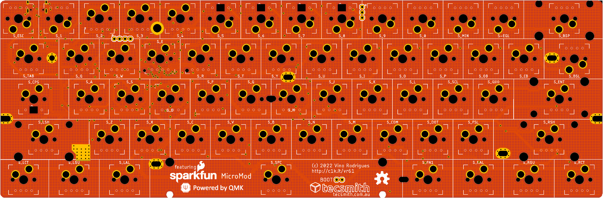
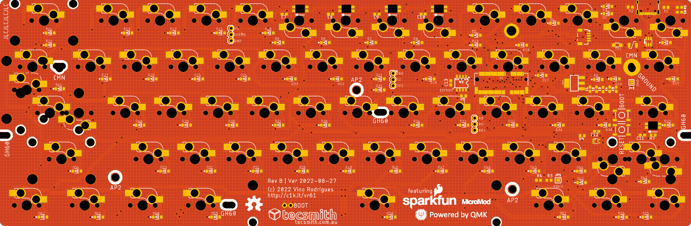

# VR61 - Swappable Microcontroller Custom Keyboard PCB

***Featuring SparkFun's MicroMod Processor Boards***

---

> Very happy to announce that [PCBWay]((https://pcbway.com)) has gratefully sponsored the production of the first 5 PCBs, and a partial assembly service, for this project.  *(I will post images and results of the prototype testing herein as soon as I can.)*

]

> Thank you [PCBWay]((https://pcbway.com))!

---

Published as Open Source, under [MIT License](LICENSE.md):
* [PDF Schematic](docs/vr61.pdf)
* [EAGLE PCB](EAGLE/vr61/vr61.brd)
* [EAGLE Schematic](EAGLE/vr61/vr61.sch)

Interim QMK code:
* https://github.com/Tecsmith/vr61-keyboard-qmk

## Features

**VR61-MicroMod** - using SparkFun MicroMod STM32 or RP2040 M.2 module

### Core Design Elements

- 60% form factor
    - Design to be compatible with GH60/HK60 cases
    - Also compatible with Anne Pro 2 case *(drop in QMK replacement for existing AP2's or AP2 cases)*
    - MicroMod positioned in case *"battery compartment"* space.

- QMK + VIA default f/w
    - Wired only *(no wireless)*
    - Default key-maps for Mac use

- User choice of microcontroller
    
    - [STM32 Processor](https://www.sparkfun.com/products/17713)
        - ARM Cortex-M4, 168MHz, 1MB Flash, 192kB SRAM
        - https://github.com/Tecsmith/vr61-keyboard-qmk

    - [RP2040 Processor](https://www.sparkfun.com/products/17720)
        - ARM Cortex-M0+, 133MHz, 128Mb Flash (16MB external), 264kB SRAM in six banks
        - *(up next in the the dev cycle)*

    To explore in the future:

    - ~~[SAMD51 Processor](http://www.sparkfun.com/products/16791)~~
        - ~~ARM Cortex-M4F, 120MHz, 1MB Flash, 256kB SRAM~~
        - ~~*(uncertain if this is viable)*~~

    - ~~[Teensy Processor](http://www.sparkfun.com/products/16402)~~
        - ~~ARM Cortex-M7, 600MHz, 16MB Flash, 1024kB RAM~~
        - ~~*(uncertain if this is viable)*~~

    - ~~[nRF52840 Processor](http://www.sparkfun.com/products/16984)~~
        - ~~ARM Cortex-M4, 64MHz, 1MB Flash, 256kB SRAM, Bluetooth 5~~
        - ~~*(uncertain if this is viable)*~~

- USB-C *(left side)*

    ... but also optional JST connector for [ai03 Unified C3 Daughterboard](https://github.com/ai03-2725/Unified-Daughterboard)

- ESD, Over Voltage and Over Current protection

    ... and cable shield noise filter

- Hot-swap, 5 pin switch slots

- PCB mounted stabs compatibility

- [1.25, 1.25, 1.25, **6.25**, 1.25, 1.25, 1.25, 1.25] bottom row *(a.k.a. "Poker" / "POK3R")*

- Limited RGB LEDs

    - RGB Caps Lock Indicator

    - North facing RGB's under the `5`, `6`, `7` & `8` keys for layer indicator

    - WS2812 breakout for optional external LEDs

- Spare GPIO slots (`A0` & `PWM`) for expansion

- Both `[Reset]` and `[Boot]` buttons

    ... plus under space-bar Boot pins for bootload without disassembly

---
Made with &#9829; - Vino Rodrigues
