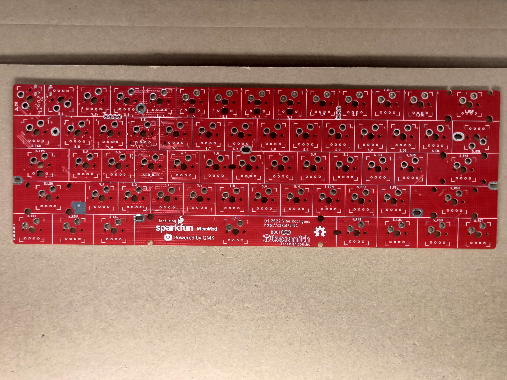
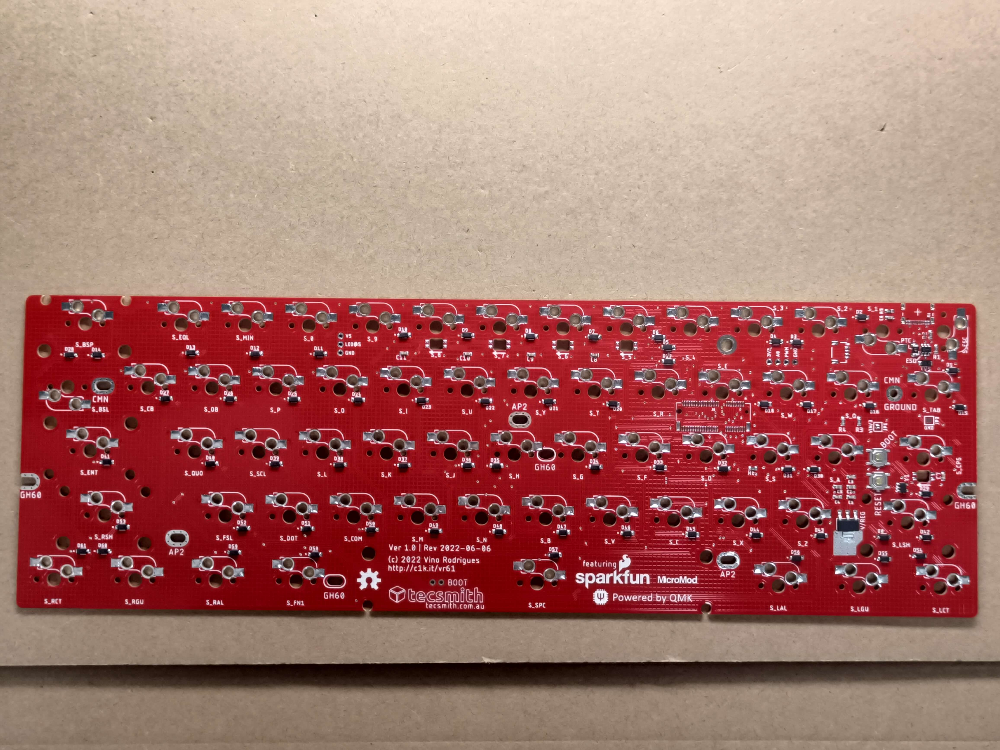
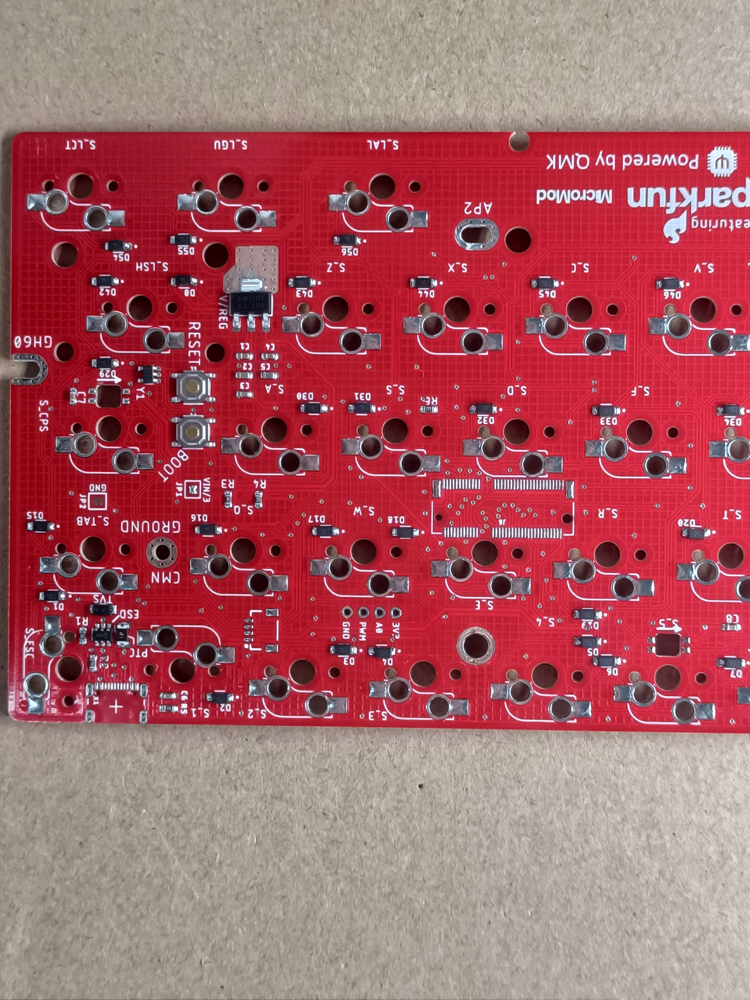
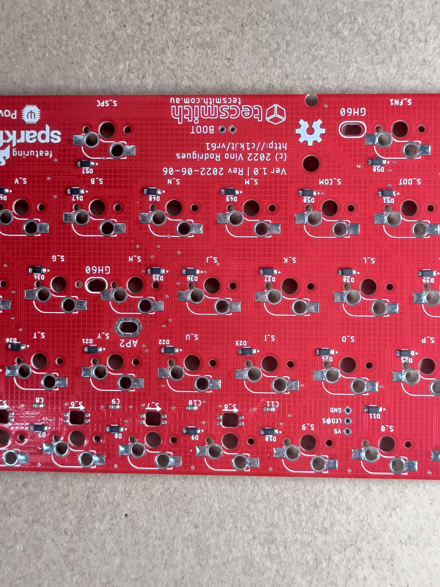
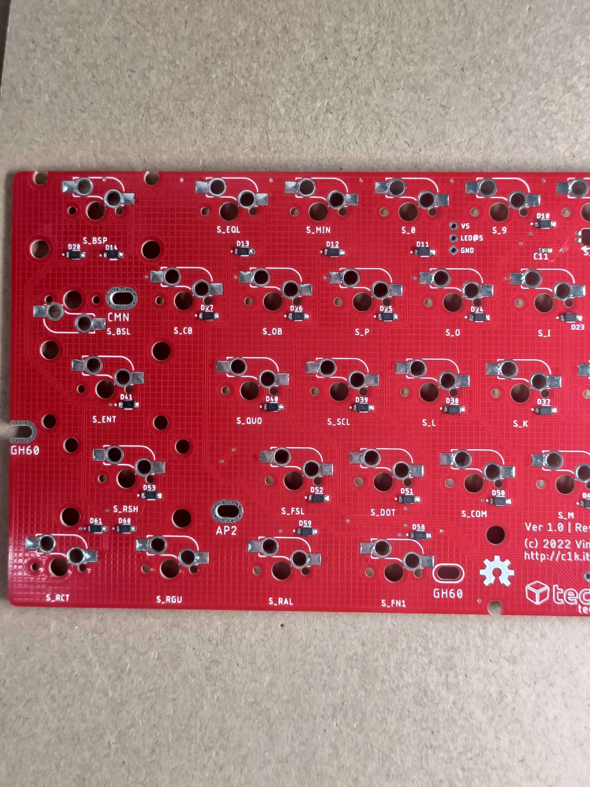

# Updates
All notable updates to this project will be documented in this file.

*(The format is based on [Keep a Changelog](https://keepachangelog.com/en/1.0.0/).)*

- [PCBWay](https://pcbway.com) graciously offered to sponsor the prototype build of this keyboard

## Up Next

- Solder on LED's, Hot-Swap sockets & USB Connector
- PCB Testing
- QMK code finalization

## 2022-06-17

- Order placed and confirmation received.

## 2022-06-28

### Finished goods photos sent
- Got an email will the finished build - shipping to me next.
  
  
  
  
  
  
